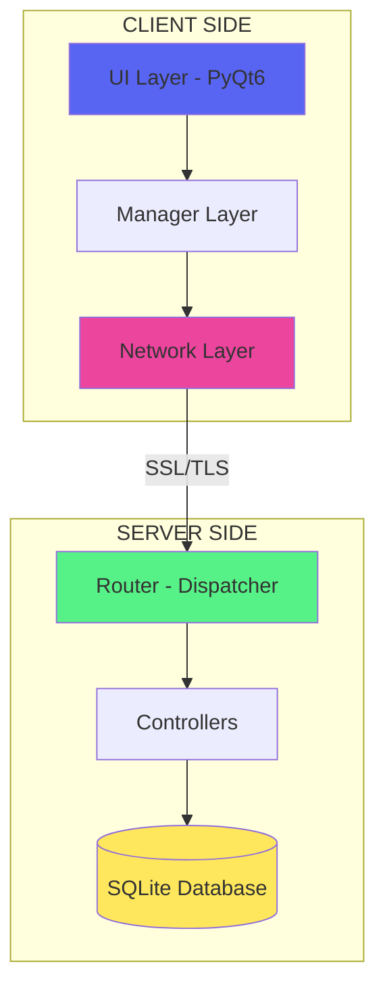
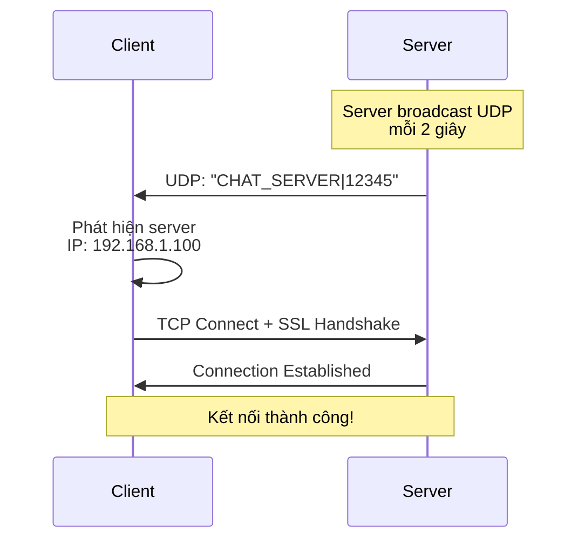
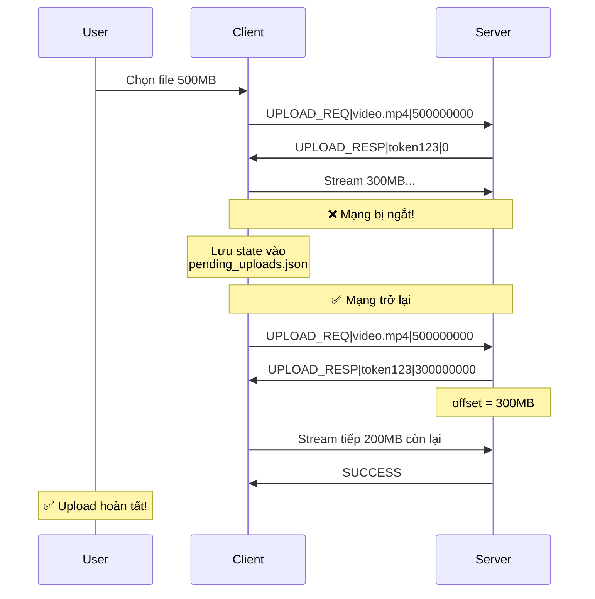
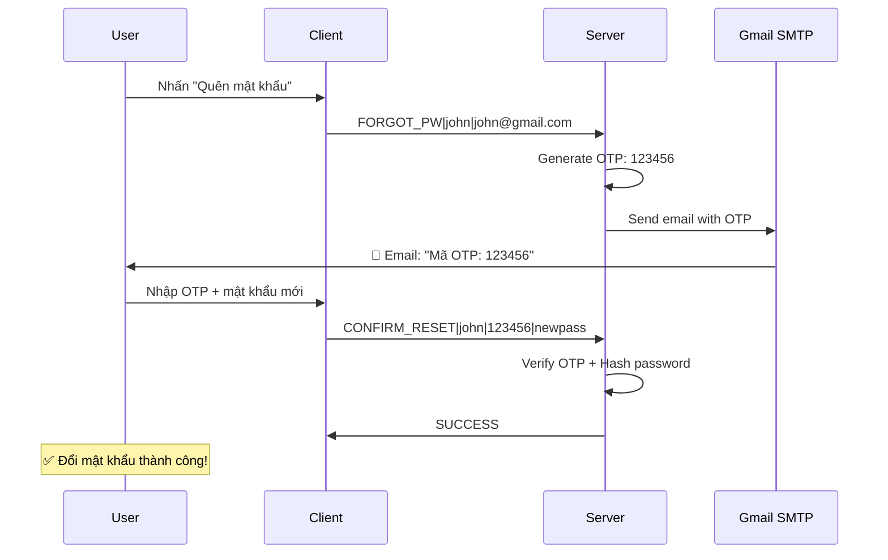

# 🚀 GIỚI THIỆU SẢN PHẨM - CHATAPP

> **Đồ án môn học:** Lập trình mạng (Network Programming)  
> **Nhóm thực hiện:** Nhóm 19  
> **Công nghệ:** Python, PyQt6, Socket Programming, SSL/TLS

---

## 📋 TỔNG QUAN SẢN PHẨM

**ChatApp** là ứng dụng chat desktop thời gian thực với kiến trúc Client-Server, được xây dựng hoàn toàn bằng Python. Sản phẩm không chỉ đáp ứng các yêu cầu cơ bản của môn học mà còn tích hợp nhiều tính năng nâng cao, thể hiện khả năng ứng dụng kiến thức mạng máy tính vào thực tế.

### 🎯 Mục tiêu sản phẩm

- Xây dựng hệ thống chat hoàn chỉnh hoạt động trên mạng LAN/Internet
- Áp dụng các kỹ thuật lập trình mạng nâng cao (Multi-threading, Protocol Design, SSL/TLS)
- Tạo ra sản phẩm có tính thực tiễn cao, giao diện thân thiện
- Đảm bảo tính bảo mật và độ tin cậy của dữ liệu

---

## ✨ TÍNH NĂNG NỔI BẬT

### 🌟 **1. Kết Nối Thông Minh**

#### UDP Auto-Discovery
- Server tự động phát sóng (broadcast) thông tin trên mạng LAN
- Client tự động tìm và kết nối server mà không cần cấu hình thủ công
- **Lợi ích:** Plug-and-play experience - chỉ cần mở app là dùng ngay!

#### Auto-Reconnect
- Tự động kết nối lại khi mạng trở lại
- Không mất session, không mất dữ liệu
- Heartbeat monitoring phát hiện mất kết nối trong 30 giây

### 📁 **2. Truyền Tải File Thông Minh (Smart File Transfer)**

> [!IMPORTANT]
> Đây là tính năng nâng cao nhất của sản phẩm, hiếm có trong đồ án sinh viên!

#### Resume Upload/Download
```
Kịch bản thực tế:
1. User đang upload file 500MB (đã tải 300MB)
2. Mạng bị ngắt đột ngột
3. Khi có mạng lại → Tự động tiếp tục từ byte thứ 300,000,000
4. Không cần tải lại từ đầu!
```

**Cơ chế hoạt động:**
- Lưu trạng thái upload vào `pending_uploads.json`
- Server ghi nhớ offset (vị trí) đã nhận
- Resume bằng cách gửi tiếp từ offset

#### Chunked Transfer
- Chia file thành các gói 64KB
- Hỗ trợ file lớn đến 4GB
- Không block luồng chat chính

### 🔒 **3. Bảo Mật Toàn Diện**

#### SSL/TLS Encryption
- Mọi dữ liệu được mã hóa end-to-end
- Sử dụng certificate tự ký (self-signed)
- Chống nghe lén (man-in-the-middle attack)

#### Bcrypt Password Hashing
- Mật khẩu không bao giờ lưu plaintext
- Hash với Salt 12 rounds
- Chuẩn bảo mật industry-level

#### Email OTP Reset Password
- Quên mật khẩu? Nhận mã OTP qua email
- Tích hợp SMTP Gmail
- Flow xác thực an toàn: Username → Email → OTP → New Password

### 💬 **4. Chat Realtime Đầy Đủ**

| Tính năng | Mô tả |
|-----------|-------|
| **Text Message** | Tin nhắn văn bản cơ bản |
| **Image Sharing** | Gửi/nhận ảnh với preview ngay trong chat |
| **File Transfer** | Gửi mọi loại file (doc, pdf, video, zip...) |
| **History** | Lưu trữ vĩnh viễn, load more khi cuộn lên |
| **Online Status** | Hiển thị ai đang online/offline realtime |
| **Multi-device** | Đăng nhập nhiều thiết bị cùng lúc |

### 🎨 **5. Giao Diện Hiện Đại**

#### Discord-inspired Dark Theme
- Giao diện tối giảm mỏi mắt
- Màu sắc hài hòa, chuyên nghiệp
- Layout intuituve, dễ sử dụng

#### Live Avatar Updates
```
User A thay đổi avatar → Broadcast realtime đến tất cả clients
→ Avatar trong sidebar + chat bubbles cập nhật ngay lập tức
→ Không cần refresh!
```

#### Toast Notifications
- Thông báo nổi tự build (không dùng thư viện)
- 3 loại: Success (xanh), Error (đỏ), Info (vàng)
- Auto-dismiss sau 3 giây

#### Async Image Loading
- Load ảnh Base64 trên background thread
- UI không bao giờ lag khi scroll
- Giữ 60fps mượt mà

---

## 🏗️ KIẾN TRÚC HỆ THỐNG

### Tổng Quan



### Protocol Design

**Custom Length-Prefix Protocol**
```
┌─────────────┬──────────────────────────┐
│  4-byte     │    Variable Length       │
│  Length     │    Payload Body          │
│  Header     │    (UTF-8 String)        │
└─────────────┴──────────────────────────┘
```

**Ưu điểm:**
- Không bị TCP stream fragmentation
- Dễ parse, hiệu suất cao
- Hỗ trợ message bất kỳ độ dài

### Các Giao Thức Chính

| Command | Format | Mục đích |
|---------|--------|----------|
| `LOGIN` | `LOGIN\|username\|password` | Đăng nhập |
| `REGISTER` | `REGISTER\|user\|pass\|name\|email` | Đăng ký |
| `MSG` | `MSG\|content` | Gửi tin nhắn |
| `UPLOAD_REQ` | `UPLOAD_REQ\|filename\|size` | Yêu cầu upload file |
| `FORGOT_PW` | `FORGOT_PW\|username\|email` | Gửi OTP reset password |
| `PING` | `PING` | Heartbeat check |

---

## 🎬 DEMO WORKFLOW

### Workflow 1: Kết Nối Lần Đầu



### Workflow 2: Upload File + Resume



### Workflow 3: Reset Password



---

## 📊 PHÂN TÍCH KỸ THUẬT

### Multi-threading Architecture

| Thread | Chức năng | Tại sao cần? |
|--------|-----------|--------------|
| **Main Thread** | UI Event Loop (PyQt6) | Responsive interface |
| **Receiver Thread** | Nhận packet từ server | Không block UI |
| **Heartbeat Thread** | Gửi PING mỗi 10s | Detect zombie connections |
| **File Transfer Thread** | Upload/Download file | Không làm lag chat |
| **Broadcast Thread** | UDP discovery | Tự động tìm server |

### Database Schema

```sql
-- Users Table
CREATE TABLE users (
    username TEXT PRIMARY KEY,
    password_hash TEXT NOT NULL,      -- Bcrypt hash
    fullname TEXT,
    email TEXT,
    avatar TEXT,                       -- Filename
    created_at TIMESTAMP
);

-- Messages Table
CREATE TABLE messages (
    id INTEGER PRIMARY KEY AUTOINCREMENT,
    username TEXT,
    content TEXT,
    msg_type TEXT,                     -- 'text', 'image', 'file'
    timestamp TIMESTAMP,
    FOREIGN KEY (username) REFERENCES users(username)
);

-- File Transfers Table
CREATE TABLE file_transfers (
    file_id TEXT PRIMARY KEY,
    username TEXT,
    filename TEXT,
    total_size INTEGER,
    uploaded_bytes INTEGER,           -- For resume
    status TEXT,                       -- 'pending', 'complete', 'failed'
    file_path TEXT
);
```

### Performance Optimizations

#### 1. Avatar LRU Cache
```python
# Server cache avatar để giảm disk I/O
self.avatar_cache = {}  # {filename: (mtime, base64_data)}
self.avatar_cache_order = []  # LRU tracking
self.AVATAR_CACHE_MAX = 50
```
- Chỉ đọc file khi modified time thay đổi
- Giới hạn 50 avatar trong memory
- LRU eviction policy

#### 2. Async Image Decoding (Client)
```python
# Decode Base64 trên background thread
def decode_in_thread():
    img_data = base64.b64decode(avatar_b64)
    qimage = QImage.fromData(img_data)
    return qimage
```
- UI thread không bị block
- Smooth scrolling ngay cả với nhiều ảnh

#### 3. Chunked Streaming
```python
chunk_size = 65536  # 64KB chunks
while sent_bytes < file_size:
    chunk = file.read(chunk_size)
    socket.sendall(chunk)
```
- Memory-efficient cho file lớn
- Progress tracking chính xác

---

## 🎯 ĐÁNH GIÁ & KẾT LUẬN

### Điểm Mạnh

| Khía cạnh | Đánh giá |
|-----------|----------|
| **Tính năng** | ⭐⭐⭐⭐⭐ Đầy đủ và vượt yêu cầu |
| **Bảo mật** | ⭐⭐⭐⭐⭐ SSL + Bcrypt + OTP |
| **Độ tin cậy** | ⭐⭐⭐⭐⭐ Resume transfer, auto-reconnect |
| **UX/UI** | ⭐⭐⭐⭐⭐ Modern, responsive, polished |
| **Code quality** | ⭐⭐⭐⭐☆ Modular, well-structured |

### Tính Năng Vượt Trội So Với Đồ Án Thông Thường

> [!TIP]
> Các tính năng này thể hiện sự đầu tư nghiêm túc của nhóm:

1. **Resume Transfer** - Production-level feature, rất khó implement
2. **UDP Auto-discovery** - Zero-config networking
3. **Live Avatar Broadcast** - Realtime sync across clients
4. **Email OTP** - Enterprise authentication flow
5. **Multi-threading** - Professional architecture
6. **SSL Encryption** - Security-first mindset

### Kỹ Năng Đạt Được

Qua quá trình làm đồ án, nhóm đã nắm vững:

- ✅ Socket Programming (TCP/UDP)
- ✅ Multi-threading và concurrency
- ✅ Protocol design và packet parsing
- ✅ SSL/TLS encryption
- ✅ Database design (SQLite)
- ✅ Client-Server architecture
- ✅ GUI Programming (PyQt6)
- ✅ Error handling và resilience
- ✅ SMTP protocol integration
- ✅ Binary data handling (Base64, chunking)

### Ứng Dụng Thực Tế

ChatApp có thể được sử dụng cho:

- 🏢 Chat nội bộ văn phòng/công ty nhỏ
- 🎓 Giao tiếp trong lớp học/nhóm học tập
- 🏠 Mạng gia đình (home network)
- 🎮 Game lobby chat
- 📡 IoT devices communication

---

## 🚀 HƯỚNG PHÁT TRIỂN

Nếu có thêm thời gian, sản phẩm có thể mở rộng:

- [ ] Group chat (tạo phòng, mời thành viên)
- [ ] Voice/Video call (WebRTC)
- [ ] Mobile app (Kivy/React Native)
- [ ] Message encryption (E2E with RSA)
- [ ] File preview trong app
- [ ] Search message history
- [ ] Emoji picker
- [ ] Push notifications
- [ ] Web interface (WebSocket)

---

## 📝 KẾT LUẬN

**ChatApp** là một sản phẩm đồ án hoàn chỉnh, không chỉ đáp ứng yêu cầu môn học mà còn thể hiện:

- 🎯 **Tầm nhìn sản phẩm:** Không chỉ làm đủ, mà làm tốt
- 💡 **Tư duy kỹ thuật:** Áp dụng best practices từ thực tế
- 🔧 **Kỹ năng implementation:** Xử lý edge cases, error handling
- 🎨 **Chú trọng UX:** Sản phẩm đẹp, dễ dùng, chuyên nghiệp

> **"Một đồ án không chỉ để lấy điểm, mà còn là minh chứng cho năng lực thực chiến."**

---

**Nhóm 19 xin chân thành cảm ơn!** 🙏
